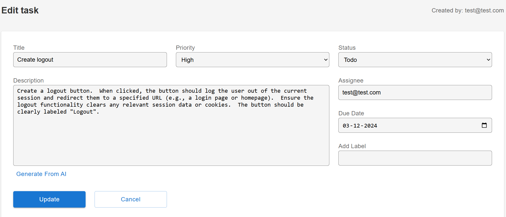
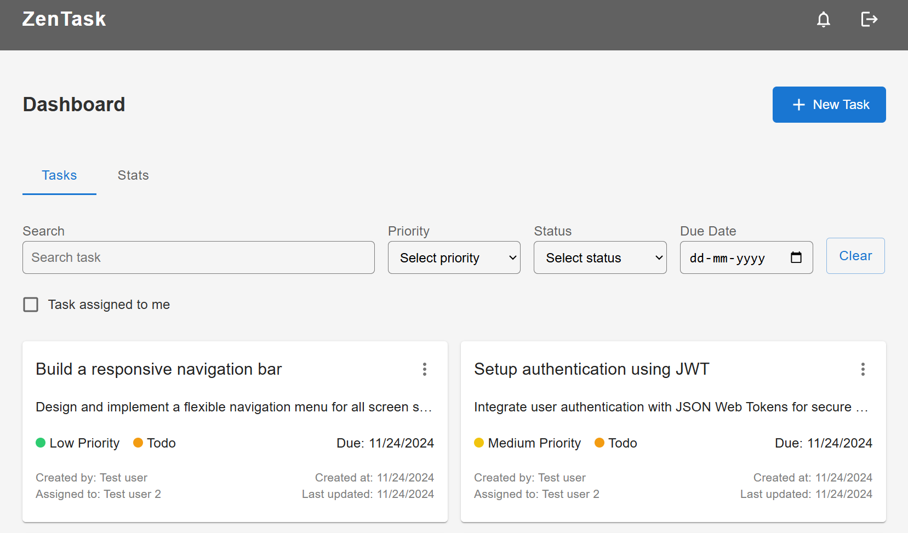

# Task Management Application (MERN Stack)

### Live demo https://task-management-mern-prod.onrender.com/

### 📚 Project Overview
This is a full-featured **Task Management Application** built using the **MERN stack** (MongoDB, Express.js, React, Node.js). It enables users to create, manage, and filter tasks efficiently while ensuring secure access and personalized functionality. The project is designed with **JWT-based authentication**, a live **due-date alert system**, and user-friendly interfaces. Additionally, the application is **fully optimized for mobile devices**, providing a seamless experience across all screen sizes. Users can also **visualize task statistics** through dynamic charts, making it easier to track task distribution and progress.

---

### 🚀 Features
### Authentication & Authorization
- Implemented JWT-based authentication for secure login and user access.
- Protected APIs: All task-related APIs are secured to prevent unauthorized access.
- Users must register or log in before accessing any application features.

### Task Management
- #### Add & Edit Tasks:
  - Users can create tasks with mandatory fields like title, description, priority, due date, and assignee.
  - Task status is optional and by default it will be "Todo".
  - Creator details will be added at the backend after validating user (JWT verify).
  - Built-in server validations ensure that due dates and assignee names are valid.
- #### Delete Tasks:
  - Only the creator of a task can delete it for secure task management.
- #### Labels/Tags:
  - Users can assign multiple labels/tags to tasks for better categorization.
 
    
 
### Comments
- Add comments to any task for better collaboration.
- Only the comment creator can edit or delete their comments.
- Comments are always sorted in a created-at-first order for better readability.

  

### Dashboard
- Tasks are listed with pagination for efficient browsing and management.
- Tasks are displayed in descending order of due date, showing the most urgent tasks first.
  
  

### Filtering & Sorting
- Powerful task filtering options:
  - By title, priority, status, due date, or assignee.
- Tasks are always sorted in a due-date-first order for better prioritization.

### Due Date Alerts
- Real-time alerts for tasks due today:
  - Implemented Server-Sent Events (SSE) to maintain a live connection between the server and client.
  - A cron scheduler on the server runs after every interval to send alerts for tasks due today.
  - Alerts are sent to the correct assignees in real-time.
 
    
    
### Task Stats
- Visualize task statistics for better tracking and analysis:
    - Provides insights into task distribution based on priority and status.
    - The user can view the number of tasks categorized by priority (Low, Medium, High) and by status (ToDo, In Progress, Done).
    - Stats help users monitor task progress and workload effectively.
 
      

### User APIs
- Core user-related functionalities implemented:
  - Sign Up, Login, Logout, and Get Current User APIs.
 
    
 
-------
 
### 🔑 Technologies Used
- **Frontend:** React.js + Material-UI (MUI)
- **Backend:** Node.js, Express.js
- **Database:** MongoDB
- **Authentication:** JSON Web Tokens (JWT)
- **Real-time Alerts:** Server-Sent Events (SSE) with Cron Jobs
- **Task & User Validations:** Mongoose

---

### 📦 API Endpoints
### Authentication
- **POST `/api/auth/register`** - Register a new user.

    - Request Body:
      ```
      {
        "name": "test user",
        "email": "test@example.com",
        "password": "strongpassword123"
      }
      ```
- **POST `/api/auth/login`** - Log in an existing user.
  
    - Request Body:
      ```
      {
        "email": "test@example.com",
        "password": "strongpassword123"
      }
      ```
- **GET `/api/auth/logout`** - Log out the current user.
- **GET `/api/auth/getCurrentUser`** - Fetch the currently logged-in user.
### Tasks
- **GET `/api/tasks`** - Fetch all tasks with pagination.

    - Query Parameters (optional):
      ```
        page=1
        limit=10
      ```
- **GET `/api/tasks/search`** - Fetch all tasks with filtering and pagination.

    - Query Parameters (at least one param is required except page and limit):
      ```
        title=task1
        priority=High
        status=In Progress
        dueDate=2024-11-23
        assignee=test@example.com
        page=1
        limit=10
      ```
- **GET `/api/tasks/getStats`** - Fetch tasks statistics.

    - Query Parameters (optional):
      ```
        "assignee": "test@test.com"
      ```
- **GET `/api/tasks/:id`** - Get a task.
- **POST `/api/tasks`** - Add a new task with optional labels/tags.

    - Request Body:
      ```
      {
        "title": "Fix Bugs in Dashboard",
        "description": "Resolve the UI glitches in the dashboard section.",
        "dueDate": "2024-11-23",
        "assignee": "test@example.com",
        "priority": "High",
        "status": "In Progress",
        "labels": ["UI", "Bug Fix"]
      }
      ```
- **PUT `/api/tasks/:id`** - Edit a task.

    - Request Body:
      ```
      {
        "title": "Fix Bugs in Dashboard",
        "description": "Resolve the UI glitches in the dashboard section.",
        "dueDate": "2024-11-23",
        "assignee": "test@example.com",
        "priority": "High",
        "status": "In Progress",
        "labels": ["UI", "Bug Fix"]
      }
      ```
- **DELETE `/api/tasks/:id`** - Delete a task (only by creator).
### Comments
- **POST `/api/tasks/comments`** - Add a comment to a task.

    - Request Body:
      ```
      {
        "taskId": "123456",
        "text": "This task is critical and needs to be addressed ASAP."
      }
      ```
- **PUT `/api/tasks/comments/`** - Edit a comment (only by creator).

    - Request Body:
      ```
      {
        "commentId": "123456",
        "text": "This task is critical and needs to be addressed ASAP."
      }
      ```
- **DELETE `/api/tasks/:id/comments/:commentId`** - Delete a comment (only by creator). (Here /:id is task id)
### Real-Time Alerts
- **GET `/api/reminders`** - Establishes an SSE connection for receiving real-time due date reminders.

---

### 📋 Installation & Setup
### 1. Clone the repository
```

git clone https://github.com/capi20/Task-Management-MERN.git
```
### 2. Navigate to the project directory
```

cd Task-Management-MERN
```
### 3. Install dependencies
- For the backend:
  ```
  
  cd server
  npm install
  ```
- For the frontend:
  ```
  
  cd client
  npm install
  ```
### 4. Configure environment variables
- Create a .env file in the server directory.
- Add the following:
  ```
  
  MONGO_URL=<Your MongoDB Connection String>
  JWT_SECRET=<Your Secret Key>
  JWT_LIFETIME=1d
  NODE_ENV=development
  PORT=5000
  ```

### 5. Start the application
- Run frontend and backend server concurrently
  ```
  
  cd server
  npm start
  ```
- Run only backend server
  ```
  
  cd server
  npm run server
  ```
- Run only frontend client
  ```
  
  cd client
  npm run dev
  ```
### 6. Run unit test cases
- Run backend unit test cases
  ```
  
  cd server
  npm run test
  ```
---

### 📂 Folder Structure
```

task-management-app
│
├── server
│   ├── models         // Mongoose schemas (User, Task, Comment)
│   ├── routes         // API routes for authentication & tasks
│   ├── controllers    // Business logic for APIs
│   ├── middleware     // JWT authentication and error handling
│   ├── schedulers     // Cron jobs for due date reminders
│   ├── utils          // Helper functions
│   ├── errors         // Error classes for error handling
│   ├── db             // DB connection
│
└── client
    ├── src
    │   ├── components // React components (TaskCard, Header, etc.)
    │   ├── pages      // Dashboard, Login
    │   ├── context    // App context
    │   └── styles     // CSS and MUI themes

```

---

### 🌟 Key Highlights
- **Secure APIs:** User authentication and creator based access ensure data privacy.
- **Real-Time Functionality:** Due date alerts powered by SSE and cron jobs.
- **Visualize Task Stats:** Visualize task stats through dynamic charts.
- **Custom Labels:** Personalize tasks with labels/tags.
- **Scalability:** Designed for large-scale usage with robust pagination, filtering, and sorting features.
- **Responsive UI:** Built with Material-UI for a modern, mobile optimized and intuitive user experience.

--- 

### 📬 Feedback & Contributions
Feel free to contribute or report any issues! 😊
